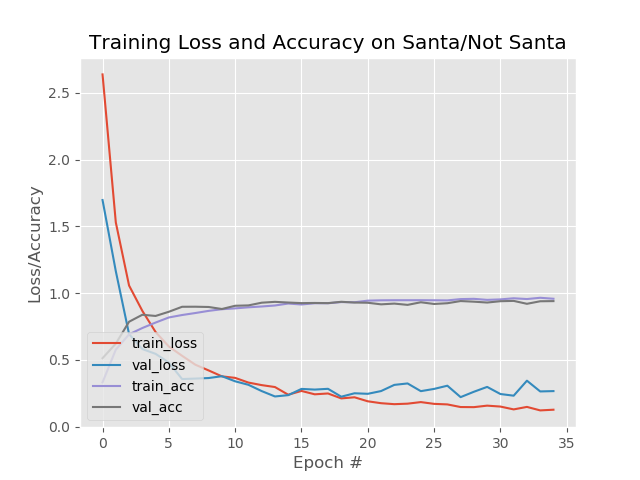
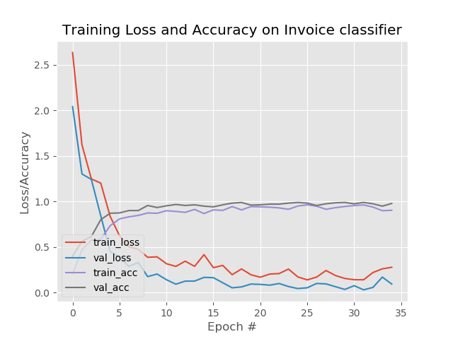

# Keras-image-classifer-framework
a general image classifer framework written by Keras

This is a general image classifer framework base on LeNet written by Keras. We can use it to deal with some classification tasks. 
In addition, we can use some deeper network base on this calssifier framework to handle more complex tasks. 

This repo includes two examples on image classification using deep learing method. 
One is traffic-sign task, the other is invoice task. We use the same framework to handle these task successfully.

Here is the plot(acc and loss) for the these two classification tasks.

 

 

Please visit my blog for more details.

http://www.cnblogs.com/skyfsm/p/8051705.html
